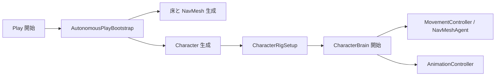

# 自律キャラクター デモ（Unity）

FBX 形式の 3D キャラクターが、シーン内の Waypoint をランダムに巡回しながら **待機・歩行・見渡し・座る** の 4 種類の行動を自律的に切り替える Unity デモプロジェクトです。  
セットアップ用のエディタメニューが付属しているため、モデルを差し替えても比較的簡単に動作確認できます。

---

## 主な機能

| 機能 | 説明 |
|------|------|
| 自律行動 | `CharacterBrain` が wait / walk / look / sit を重み付き乱数で選択 |
| NavMesh 移動 | ランタイムで床を生成し、NavMesh をベイクして歩行 |
| アニメーション連携 | FBX 内のクリップ名から自動で Animator Controller を構築 |
| ワンクリックセットアップ | メニューから床・Waypoint・キャラクターを一括配置 |
| モデル差し替え | 同じ FBX パスに差し替えるか、Inspector で Prefab を指定 |

---

## 動作環境

| 項目 | 推奨 |
|------|------|
| Unity | **2022.3 LTS**（本プロジェクト: `2022.3.62f3`） |
| OS | Windows / macOS（Unity がサポートする環境） |
| 追加パッケージ | 標準の NavMesh / Animation モジュールのみ（特別な Asset Store パッケージは不要） |

> **注意:** `Library/` フォルダは Git に含めません。クローン後、Unity でプロジェクトを開くと自動生成されます。

---

## クイックスタート（初めて使う方）

### 1. リポジトリを取得する

```bash
git clone <リポジトリURL>
cd "3Dmodel test"   # プロジェクトフォルダ名に合わせて変更
```

### 2. Unity で開く

1. **Unity Hub** を起動
2. **追加** → このフォルダ（`Assets` と `ProjectSettings` があるディレクトリ）を選択
3. エディタバージョン **2022.3.x** で開く

### 3. シーンをセットアップする

メニューから次を実行します。

```
Tools → 自律キャラ → シーンをセットアップ
```

- `Assets/Scenes/SampleScene.unity` が開き、床・Waypoint・キャラクターが配置されます
- `Assets/Animations/CharacterAnimator.controller` が自動生成・更新されます

> 初回はエディタ起動時に自動セットアップが走る場合があります（`AutonomousCharacterSetup`）。

### 4. 再生（Play）する

Unity 上部の **▶ Play** を押すと、キャラクターが歩き回り始めます。  
Console に `[自律キャラ] セットアップ完了` と表示されれば成功です。

---

## 3D モデルの置き換え方法

デフォルトでは **`Assets/untitled.fbx`** がキャラクターとして使われます。  
差し替えは次の **方法 A（おすすめ）** か **方法 B（別ファイル名を使う場合）** から選んでください。

### 方法 A：同じファイル名で上書き（最も簡単）

1. 使いたい FBX を **`Assets/untitled.fbx` として配置**（既存ファイルを置き換え）
2. FBX を選択し、Inspector の **Rig** タブで次を確認  
   - **Animation Type:** `Generic`  
   - **Avatar Definition:** `Create From This Model`
3. メニュー実行  
   ```
   Tools → 自律キャラ → FBXのAvatarを再生成
   ```
4. 続けて  
   ```
   Tools → 自律キャラ → シーンをセットアップ
   ```
5. **Play** で動作確認

### 方法 B：別の FBX ファイル名・パスを使う

コード内で FBX パスが固定されているため、次の **3 ファイル** の `FbxPath` 定数を同じパスに変更してください。

| ファイル | 定数 |
|----------|------|
| `Assets/Scripts/Character/CharacterRigSetup.cs` | `FbxPath` |
| `Assets/Editor/AutonomousCharacterSetup.cs` | `FbxPath` |
| `Assets/Scripts/Core/AutonomousPlayBootstrap.cs` | `FbxPath` |

例:

```csharp
const string FbxPath = "Assets/Models/MyCharacter.fbx";
```

変更後は **方法 A の 3〜5** と同様に Avatar 再生成 → シーンセットアップ → Play です。

### 方法 C：Inspector で Prefab を直接指定（Play 時の上書き用）

1. ヒエラルキーで **`AutonomousWorld`** を選択
2. **Autonomous Play Bootstrap** コンポーネントの  
   **Character Model Prefab** に差し替えたい FBX（または Prefab）をドラッグ
3. **Animator Controller** に `Assets/Animations/CharacterAnimator.controller` が入っていることを確認
4. Play

> Avatar の再インポート設定は `CharacterRigSetup` の `FbxPath` を参照するため、**方法 B と併用**するか、方法 A と同様に FBX の Rig を手動で Generic に設定してください。

---

## モデルに必要なアニメーション

セットアップスクリプトは、FBX 内の **AnimationClip 名** に次のキーワードが含まれるクリップを自動検索します（大文字小文字は無視）。

| キーワード | 行動 | Animator の状態名 |
|------------|------|-------------------|
| `wait` | 待機 | Wait |
| `walk` | 歩行 | Walk |
| `look` | 見渡し | Look |
| `sit` | 座る | Sit |

**例（クリップ名）:** `mixamo.com__wait`, `character_walk`, `LookAround`, `sit_idle` など

### アニメーションが無い・名前が違う場合

- クリップ名を上記キーワードを含む名前にリネームする（Unity の Import Settings → Animation タブ）
- または `Assets/Animations/CharacterAnimator.controller` を手動で編集し、各 State にクリップを割り当てる
- その後 **シーンをセットアップ** を再実行

### モデルの形式・骨格

- **Humanoid でも Generic でも可**（本プロジェクトは **Generic + Avatar 自動生成** を前提に設定）
- スキンメッシュ付きキャラクター推奨（単一メッシュでも動作します）
- 身長は自動補正されますが、極端に小さい／大きいモデルは `FitCharacter` でスケール調整されます

---

## プロジェクト構成

```
Assets/
├── untitled.fbx              # デフォルトキャラクターモデル（差し替え可能）
├── Scenes/
│   └── SampleScene.unity     # メインシーン
├── Animations/
│   └── CharacterAnimator.controller
├── Editor/
│   ├── AutonomousCharacterSetup.cs   # シーン一括セットアップ
│   └── FbxAvatarFixer.cs             # Avatar 再生成メニュー
└── Scripts/
    ├── Core/                 # 起動・NavMesh・床生成
    ├── Character/            # 脳・移動・アニメ・リグ
    └── Navigation/           # Waypoint
```

### 処理の流れ（概要）



| コンポーネント | 役割 |
|----------------|------|
| `AutonomousPlayBootstrap` | Play 時にワールドとキャラを構築 |
| `NavMeshRuntimeBuilder` | 床メッシュから NavMesh をベイク |
| `CharacterBrain` | 行動の選択（待機・歩行・見渡し・座る） |
| `MovementController` | NavMeshAgent による移動 |
| `AnimationController` | 状態に応じた Animator パラメータ制御 |
| `WaypointManager` | ランダムな目的地の提供 |

---

## カスタマイズ

### 歩行ルート（Waypoint）を変える

- ヒエラルキーの **`WaypointManager`** 配下の `Waypoint_A` 〜 などを移動
- 子オブジェクトに **`Waypoint`** コンポーネントを付けた空オブジェクトを追加すれば経路点を増やせます
- 変更後は Play で反映（セットアップの再実行は不要な場合が多い）

### 行動のバランスを変える

`Character` オブジェクトの **`Character Brain`** で調整できます。

- 各状態の **重み（Weights）** … 数値が大きいほど選ばれやすい
- **待機・見渡し・座る** の時間（Min / Max）
- **Repeat Penalty** … 同じ行動の連続を抑える

### 移動速度

`Character` の **Nav Mesh Agent** → Speed、Angular Speed など  
歩行アニメの見た目は **Animation Controller** の Walk Anim Speed で調整できます。

---

## エディタメニュー一覧

| メニュー | 説明 |
|----------|------|
| `Tools → 自律キャラ → シーンをセットアップ` | SampleScene を再構築（床・Waypoint・キャラ・Animator） |
| `Tools → 自律キャラ → FBXのAvatarを再生成` | `untitled.fbx` の Rig を Generic で再インポート |

---

## トラブルシューティング

| 症状 | 対処 |
|------|------|
| キャラが T-pose のまま | `FBXのAvatarを再生成` → シーン再セットアップ。FBX の Rig が Generic か確認 |
| 歩かない | `WaypointManager` に Waypoint があるか、Console に NavMesh エラーが無いか確認 |
| アニメが切り替わらない | クリップ名に wait / walk / look / sit が含まれるか確認し、セットアップを再実行 |
| `untitled.fbx が見つかりません` | `Assets/untitled.fbx` を配置するか、`FbxPath` / Bootstrap の Prefab を設定 |
| Play しても何も起きない | シーンに `AutonomousWorld` があるか、`Tools → シーンをセットアップ` を実行 |
| モデルが地面に埋まる／浮く | セットアップを再実行（`FitCharacter` が再計算）。それでもダメなら Character の位置を微調整 |

---

## GitHub に公開する際のメモ

リポジトリルート（または親フォルダ）の `.gitignore` で次が除外される想定です。

- `Library/`, `Temp/`, `Logs/`, `UserSettings/`
- `*.csproj`, `*.sln` など IDE 生成物

**含めるもの:** `Assets/`, `Packages/`, `ProjectSettings/`  
**含めないもの:** `Library/`, 個人の `UserSettings/`

モデル（FBX）やテクスチャの **利用許諾** は各自の素材に従ってください。サンプルの `untitled.fbx` を公開する場合は、権利関係を README または LICENSE で明記することを推奨します。

---

## ライセンス

本リポジトリのライセンスはリポジトリ所有者が `LICENSE` ファイルで指定してください。  
Mixamo 等の外部アセットを使う場合は、各サービスの利用規約も遵守してください。

---

## 参考：関連スクリプトのエントリポイント

- セットアップ: `Assets/Editor/AutonomousCharacterSetup.cs`
- Play 時構築: `Assets/Scripts/Core/AutonomousPlayBootstrap.cs`
- リグ・アバター: `Assets/Scripts/Character/CharacterRigSetup.cs`
- 行動 AI: `Assets/Scripts/Character/CharacterBrain.cs`

質問や改善提案は GitHub の Issues へどうぞ。
